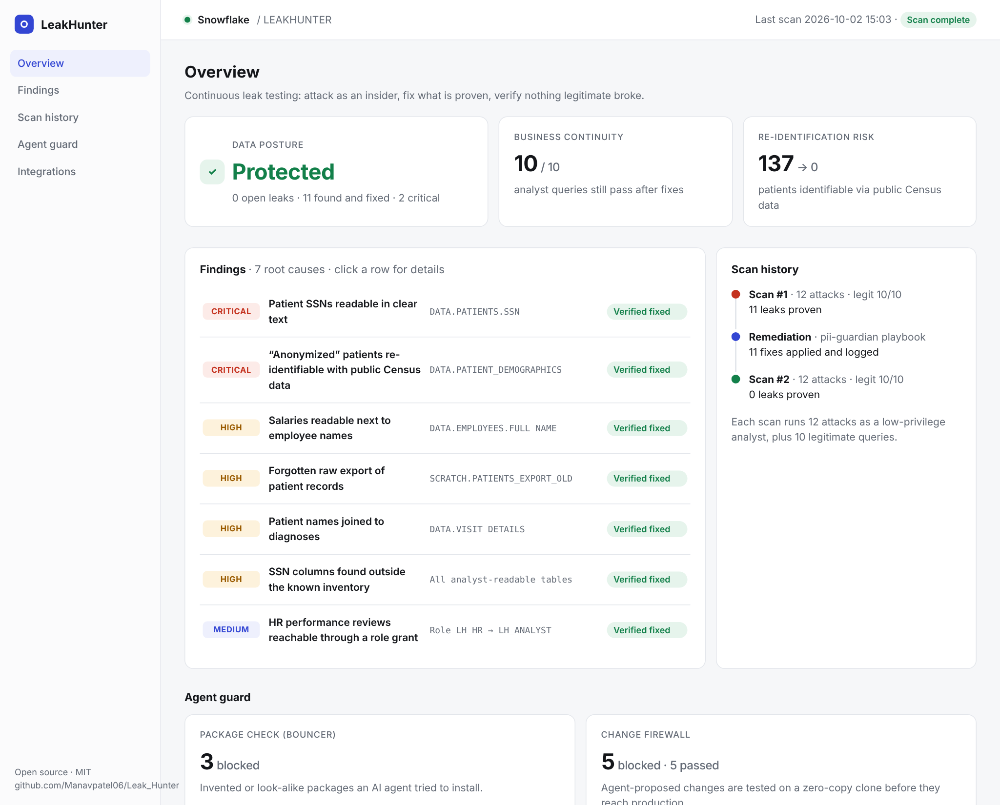

# LeakHunter

**Prove your data is safe.** LeakHunter is continuous data leak assurance for Snowflake: it attacks your warehouse the way a curious insider would, fixes every leak it can prove, and then re-checks that the fixes hold without breaking anyone's legitimate work.

Built at sunhacks Hack Day 2026 (MLH Hacktoberfest) · MIT licensed



> Open [`site/index.html`](site/index.html) in any browser: our product page and a multi-page dashboard (overview, findings, scan history, agent guard, integrations) built from our last full run.

---

## Why we built this

Most data leaks are not dramatic hacks. They are a column nobody masked, a role that was granted "just for this week", an export someone forgot to delete, or a dataset that is called anonymous but isn't. ZIP code, birth date and sex are enough to single out most people, and that kind of data gets shared all the time.

Companies usually find these problems once a year, during an audit. Meanwhile, more and more AI agents are being given direct access to data warehouses. We wanted something that keeps checking, proves what is actually reachable instead of guessing, and fixes it without breaking the reports people rely on.

## What it does

LeakHunter runs in rounds. Each round has three steps:

1. **Attack.** A library of attacks, plus new ones written by an open-weight model (Gemma, running locally), query the warehouse using a low-privilege analyst role. They go after Social Security numbers, salaries next to names, private HR reviews, forgotten exports, and "anonymized" patient data.
2. **Fix.** Every attack that succeeds is mapped to the smallest Snowflake-native fix: a masking policy, a revoked grant, or a dropped copy. The fixes come from `pii-guardian`, an open Agent Skill, so a script or any AI agent that supports Agent Skills can apply them the same way.
3. **Prove.** A referee runs every attack again, along with a set of legitimate analyst queries. A round only counts as a success if the leaks are gone *and* the legitimate work still runs.

It also guards the door that AI agents walk through:

- **Bouncer** checks every Python package an agent wants to install and blocks names that don't exist, look-alikes of popular packages, and suspiciously new releases.
- **Change Firewall** takes any change an agent wants to make to the warehouse, applies it to a zero-copy clone first, attacks the clone, and only lets it through if nothing leaks.

## Our results

On a synthetic hospital and HR warehouse (2,000 patients, 300 employees):

| | Before | After |
|---|---|---|
| Leaks proven by attacks | 11 | **0** |
| Legitimate analyst queries working | 10 / 10 | **10 / 10** |
| "Anonymous" patients re-identified with free public Census data | 137 | **0** |

The re-identification attack joins our "anonymized" patient view with real US Census population data from Snowflake Marketplace. People in small towns turn out to be easy to single out. After LeakHunter generalizes ZIP codes and birth dates, the same join finds no one, and the analysts' reports still work.

The attacker is not a fixed script. Gemma wrote its own attacks from plain-English goals, and four of the first five leaked before the fixes. One linked patient names to diagnoses by joining the "anonymized" view back to the patient table, a route we never wrote by hand. In our latest re-check, all 13 attacks (the library plus every Gemma-written attack) came back blocked, with all 10 legitimate queries still passing.

For AI agents, the Change Firewall blocked a leaky "patients by ZIP and birth date" view in about 13 seconds (693 of 5,000 rows described fewer than 5 people) and passed the generalized rewrite in about 11 seconds.

Every leak in the report is tagged with the rule it would break (for example, HIPAA's minimum-necessary standard or GDPR's security of processing). These tags are pointers for a reviewer, not legal advice.

## Run it yourself

You need Python 3.11+ and a Snowflake account with Enterprise features (a trial works).

```bash
git clone https://github.com/Manavpatel06/Leak_Hunter.git && cd Leak_Hunter
python -m venv .venv && source .venv/bin/activate      # Windows PowerShell: .venv\Scripts\Activate.ps1
pip install -r requirements.txt
```

Run every command below from a terminal where the venv is active (the prompt starts with `(.venv)`). Otherwise Python can't find `snowflake.connector`.

1. In a Snowsight worksheet, run `sql/00_setup.sql` as ACCOUNTADMIN. It creates the database, roles, warehouse and masking policies.
2. Create a key pair for the service user and attach the public key (steps in `docs/CONTRACTS.md`, section 10).
3. Copy `.env.example` to `.env` and fill in your account. Keep `.env` and your key out of git.
4. Get **Snowflake Public Data (Free)** from Marketplace and run `sql/02_zip_population.sql`. Set `LH_PUBLIC_ZIP_TABLE=LEAKHUNTER.DATA.ZIP_POPULATION` in `.env`.
5. Optional, for the AI attacker and the live Bouncer demo: install [Ollama](https://ollama.com) and run `ollama pull gemma3:4b`. Everything else works without it; the agent demo falls back to a sample package list.
6. Run the whole cycle:

```bash
python -m setup.generate_data          # synthetic warehouse
python demo/run_demo.py loop           # plant leaks, attack, fix, re-check, report, dashboard
```

Then open `site/index.html`. Other useful commands:

| Command | What it does |
|---|---|
| `python demo/run_demo.py doctor` | Checks your setup before anything runs |
| `python demo/run_demo.py round` | One round of attacks and legitimate queries |
| `python demo/run_demo.py judge` | Opens a new hole (a "quick export"), then catches, fixes and re-checks it |
| `python demo/run_demo.py agent` | Bouncer and the Change Firewall in action |
| `python -m attacker.gemma_attacker` | Gemma writes new attacks from plain-English goals (`--goal N` for one) and saves them to `attacks/generated/` |
| `python skills/bouncer/scripts/demo_gemma.py --extra reqeusts` | Gemma suggests packages and Bouncer checks each one on PyPI |
| `python demo/run_demo.py scoreboard` | Live scoreboard in your browser |

## Bringing it to your own data

LeakHunter is meant to run against real warehouses, not just our demo data.

- **Connect** with two roles: one low-privilege role to attack as, and one admin role to apply and log fixes.
- **Describe your workload.** Attacks and legitimate queries are plain YAML files (`attacks/`, `legit/queries.yaml`), so you can add the checks that matter to your team.
- **Schedule it** after schema changes, new grants, or on a timer. Every attack, fix and re-check is stored, which gives you an audit trail.
- **Fix your way.** Let the script apply the playbook, or hand the `pii-guardian` skill to the agent you already use.

Snowflake is supported today. The attack, fix and prove loop doesn't depend on Snowflake, and support for other warehouses is next on our list.

## How it's built

- **Snowflake:** roles, masking policies, zero-copy clones, and Marketplace public data
- **Python** with `snowflake-connector-python` and key-pair authentication
- **Gemma 3** through Ollama for attacker-generated SQL, running locally
- **Two Agent Skills** (`skills/pii-guardian`, `skills/bouncer`) following the open Agent Skills standard
- **Streamlit** for the live scoreboard, and a static HTML dashboard for sharing results

## Honest limits

- A clean round means "not breakable by these attacks", not "provably safe".
- Snowflake's built-in AI assistant needs a paid account, so in our build the fixes are applied by a script that follows the skill. On a paid account, an agent can run the same skill.
- The Change Firewall works when agents send their changes through it. Enforcing that inside Snowflake is future work.

## Team

Built in one afternoon by **Reya Attri**, **Manav Patel** and **Manas Khare**.

All data in this project is synthetic. No real personal information is used anywhere.
